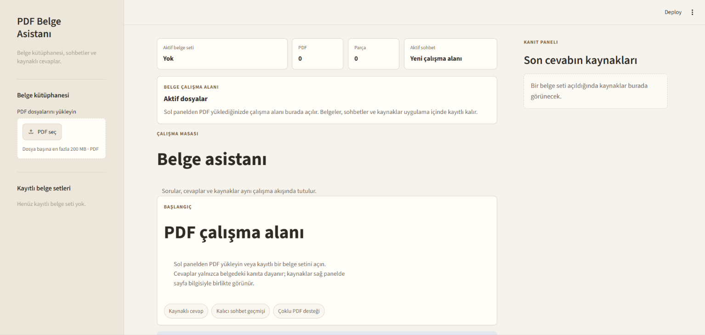
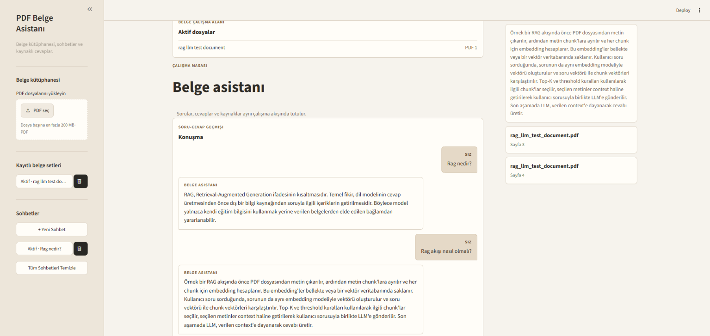

# PDF RAG Assistant

PDF RAG Assistant, PDF belgeleri üzerinde kaynak göstererek soru-cevap yapılmasını sağlayan yerel bir RAG uygulamasıdır. Streamlit tabanlı çalışma alanı; belge yönetimi, kalıcı sohbet geçmişi ve cevaplarda kullanılan sayfa referanslarını tek bir arayüzde birleştirir.

Uygulama, belgelerden çıkarılan metni çok dilli embedding modeliyle vektörleştirir ve ChromaDB üzerinde saklar. Kullanıcının sorusuyla en ilgili içerikler getirildikten sonra Gemini, yalnızca bu bağlama dayanarak cevap üretir.

## Ekran Görüntüleri

### Belge çalışma alanı



### Kaynaklı soru-cevap akışı



## Öne Çıkan Özellikler

- Bir veya birden fazla PDF ile çalışma
- Türkçe dahil çok dilli anlamsal arama
- Belge setlerinin ve vektör indekslerinin yerel olarak saklanması
- Yalnızca getirilen belge bağlamına dayalı Gemini cevapları
- Cevaplarla birlikte kaynak dosya ve sayfa bilgisi
- SQLite tabanlı kalıcı sohbet geçmişi
- Kayıtlı belge setleri ve sohbetler arasında hızlı geçiş
- Modelin yalnızca gerektiğinde yüklenmesini sağlayan tembel yükleme yaklaşımı
- Açık renkli, üç panelli üretkenlik arayüzü

## Mimari Akış

```text
PDF belgeleri
    │
    ▼
Metin çıkarma ve parçalara ayırma
    │
    ▼
multilingual-e5-base ile embedding oluşturma
    │
    ▼
ChromaDB üzerinde kalıcı vektör indeksi
    │
    ▼
Kullanıcı sorusuna göre ilgili parçaları getirme
    │
    ▼
Gemini ile bağlama dayalı cevap üretme
    │
    ▼
Cevap, kaynak dosya ve sayfa bilgisi
```

## Teknoloji Yığını

| Katman | Teknoloji |
| --- | --- |
| Kullanıcı arayüzü | Streamlit |
| PDF işleme | PyPDF |
| Metin parçalama | LangChain Text Splitters |
| Embedding | `intfloat/multilingual-e5-base` |
| Vektör veritabanı | ChromaDB |
| Cevap üretimi | Google Gemini |
| Uygulama verileri | SQLite |
| Ortam yapılandırması | python-dotenv |

## Gereksinimler

- Python 3.10 veya üzeri
- Gemini API anahtarı
- İlk model indirmesi için internet bağlantısı

## Kurulum

Depoyu klonlayın:

```bash
git clone https://github.com/gizembm/pdf-rag-assistant.git
cd pdf-rag-assistant
```

Sanal ortam oluşturun ve etkinleştirin.

Windows PowerShell:

```powershell
python -m venv .venv
.\.venv\Scripts\Activate.ps1
```

macOS veya Linux:

```bash
python3 -m venv .venv
source .venv/bin/activate
```

Bağımlılıkları yükleyin:

```bash
pip install -r requirements.txt
```

## Yapılandırma

`.env.example` dosyasını `.env` adıyla kopyalayın:

```powershell
Copy-Item .env.example .env
```

Gemini API anahtarınızı `.env` dosyasına ekleyin:

```env
GEMINI_API_KEY=your_gemini_api_key_here
```

`GOOGLE_API_KEY` değişkeni de alternatif olarak desteklenir.

## Uygulamayı Çalıştırma

```bash
streamlit run streamlit_app.py
```

Uygulama varsayılan olarak `http://localhost:8501` adresinde açılır.

## Kullanım

1. Sol panelden bir veya birden fazla PDF seçin.
2. Belgeleri kaydedip indeksleyin veya kayıtlı bir belge setini açın.
3. Çalışma alanındaki soru kutusuna belgenizle ilgili sorunuzu yazın.
4. Üretilen cevabı ve sağ paneldeki kaynak sayfaları inceleyin.
5. Kayıtlı sohbetler arasında sol panelden geçiş yapın.

İlk indeksleme veya ilk soru sırasında embedding modelinin indirilmesi ve belleğe alınması zaman alabilir. Model, uygulama süreci boyunca önbellekte tutulur. Daha önce indekslenmiş sağlam bir belge seti açılırken embedding modeli gereksiz yere yüklenmez.

## Proje Yapısı

```text
pdf-rag-assistant/
├── streamlit_app.py       # Streamlit arayüzü ve uygulama akışı
├── styles.py              # Arayüz stilleri
├── rag.py                 # PDF işleme, retrieval ve Gemini entegrasyonu
├── document_service.py    # Belge seti ve indeks yaşam döngüsü
├── database.py            # SQLite belge ve sohbet kayıtları
├── storage.py             # Yüklenen PDF dosyalarının yerel saklanması
├── requirements.txt       # Python bağımlılıkları
└── .env.example           # Örnek ortam değişkenleri
```

## Yerel Veri ve Güvenlik

Aşağıdaki içerikler yalnızca yerel ortamda tutulur ve `.gitignore` aracılığıyla Git deposunun dışında bırakılır:

- API anahtarlarını içeren `.env` dosyası
- SQLite sohbet veritabanı (`chat_history.db`)
- Chroma vektör indeksleri (`chroma_db/`)
- Kullanıcı tarafından yüklenen PDF dosyaları (`data/uploads/`)
- Yerel belge ve sanal ortam klasörleri

API anahtarınızı kaynak koduna eklemeyin veya Git deposuna göndermeyin. Cevap üretimi sırasında kullanıcı sorusu ile retrieval sonucunda seçilen belge parçaları Gemini API'ye iletilir.
